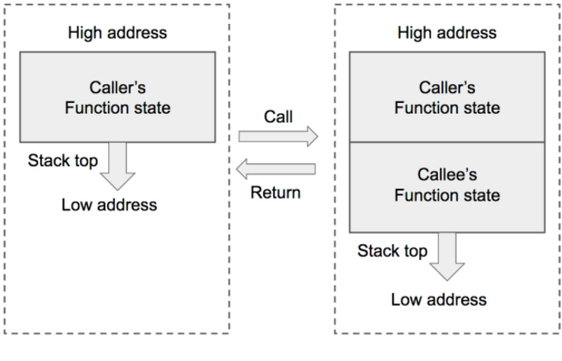
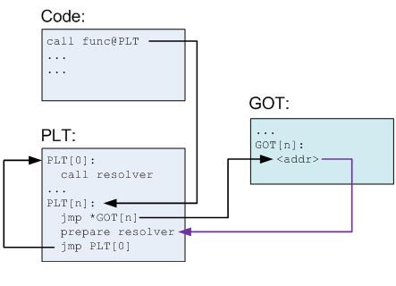
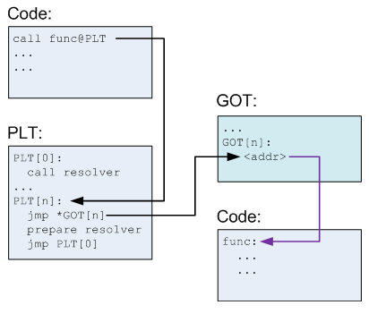

## 函数调用栈

- **定义**：函数运行时一段连续的内存区域，用来保存函数运行时的状态信息。

  状态信息包括：

  - 局部变量
  - 函数参数
  - 寄存器状态
  - 返回地址

- **图示**：函数调用栈在内存中从高地址向低地址生长，所以栈顶对应的内存地址压栈时变小，出栈时变大。

  

- 函数调用相关**寄存器**：
  - ebp
  - esp
  - eip

### 函数调用时

- 函数调用时的**核心任务**：将调用函数的状态保存起来，同时创建调用函数的状态。

- **具体步骤**：

  - **被调用函数参数入栈**：首先将被调用函数（callee）的参数按照逆序依次压入栈内。如果被调用函数（callee）不需要参数，则没有这一步骤。这些参数仍会保存在调用函数（caller）的函数状态内，之后压入栈内的数据都会作为被调用函数（callee）的函数状态来保存。
  - **返回地址入栈：**然后将调用函数（caller）进行调用之后的下一条指令地址作为返回地址压入栈内。这样调用函数（caller）的 eip（指令）信息得以保存。
  - **调用函数寄存器入栈**：再将当前的ebp 寄存器的值（也就是调用函数的基地址）压入栈内，并将 ebp 寄存器的值更新为当前栈顶的地址。这样调用函数（caller）的 ebp（基地址）信息得以保存。同时，ebp 被更新为被调用函数（callee）的基地址。
  - **被调用函数局部变量入栈：**再之后是将被调用函数（callee）的局部变量等数据压入栈内。
  - **记忆强化顺序：餐返寄菊**

- 总结：
、
  压入栈内的数据包括**调用参数、返回地址、调用函数的基地址，以及局部变量**，其中**调用参数以外的数据**共同构成了**被调用函数（callee）的状态**。

### 函数调用结束时

- **核心任务：**变化的核心任务是丢弃被调用函数（callee）的状态，并将栈顶恢复为调用函数（caller）的状态。

- 具体步骤
  - 被调用函数的**局部参数出栈**：首先被调用函数的局部变量会从栈内直接弹出，栈顶会指向被调用函数（callee）的基地址。
  - **调用函数寄存器出栈：**然后将基地址内存储的调用函数（caller）的基地址从栈内弹出，并存到 ebp 寄存器内。这样调用函数（caller）的 ebp（基地址）信息得以恢复。此时栈顶会指向返回地址。
  - **返回地址出栈：**再将返回地址从栈内弹出，并存到 eip 寄存器内。这样调用函数（caller）的 eip（指令）信息得以恢复。

## 漏洞利用技术点

- 修改返回地址，让其指向**溢出数据中的一段指令**（shellcode）
- 修改返回地址，让其指向**内存中已有的某个函数**（return2libc）
- 修改返回地址，让其指向**内存中已有的一段指令**（ROP）
- 修改某个被调用函数的地址，让其指向**另一个函数**（hijack GOT）

感觉2 4 区别不大。

### shellcode 利用要点

- 要求：

  shellcode 还需要程序调用栈有**可执行权限**

  关闭 ASLR

- 如确定返回值的地址？
  通过padding脚本
- 如何确定system函数地址？
  通过动态链接库的加载确定
- 如何确定需要调用函数的参数的地址？如 "/bin/bash"
  1.动态库搜索
  2.手动将字符串加入环境变量，再通过 getenv()函数来确定字符串的地址。

### **ROP ( Return Oriented Programming )**

- **必要性：**因为有时目标函数在内存内无法找到，有时目标操作并没有特定的函数可以完美适配。这时就需要在内存中寻找多个指令片段，拼凑出一系列操作来达成目的。假如要执行某段指令（我们将其称为“gadget”，意为小工具）

- **格式：**payload : padding + address of gadget 1 + address of gadget 2 + …… 

  \+ address of gadget n

- **要求：**每个 gadget 片段的最后一条指令都是指向 ret ，保证能将控制权交回给 caller ，然后继续执行下一个 gadget 片段。

- 利用要点

  - 如何寻找对应的指令片段？

    一般用工具，著名的包括 ROPgadget、rp++、ropeme。

  - 如何传入系统调用的参数？

    **可以用 pop 指令将栈顶数据弹入寄存器**。如果在内存中能找到直接可用的数据，也可以用 mov 指令来进行传输，不过写入数据再 pop 要比先搜索再 mov 来的简单。

###  **Hijack GOT**

- 定义：劫持函数的地址，每次对a函数的调用，都转化为对b函数的调用。

- 理解：**函数调用时程序是如何“找到”被调用函数的**

  被调用函数分为**内部函数**和**外部函数**。
  
- 具体操作：

  由于外部函数的调用过程的特点，启示了我们如何实现函数的伪装，那就是**到 GOT 表中将函数 A 的地址修改为函数 B 的地址**。这样在后面所有对函数 A 的调用都会执行函数 B。
  
- 分解步骤

  1. 确定函数a在GOT表中的位置。
  2. 确定函数b在内存中的地址
  3. 将函数b的内存地址写入函数a的got表中。

- 具体实现

  1.  函数调用的时候会访问 PLT 表，plt表存储的地址就是 GOT 表项的起始地址。
  2. **函数在动态链接库内的相对位置是固定的**，在动态库打包生成时就已经确定。如果函数a的运行时地址已经知道，那么可以通过计算相对位置来求解函数b的运行时地址。
  3. 如何修改GOT表，可以通过ROP大法达到合适的目的。

## 防御措施

- 取消栈的可执行权限：简单的 shellcode 溢出攻击就无法实现
- ASLR：增大确定堆栈内数据和动态库内函数的内存地址的难度
- 金丝雀：编译程序时还可以设置某些编译选项，使程序在运行时会在函数栈上的 ebp 地址和返回地址之间生成一个特殊的值，这个值被称为“金丝雀”（关于这个典故，请大家自行谷歌）。这样一旦发生了栈溢出并覆盖了返回地址，这个值就会被改写，从而实现函数栈的越界检查。

## 外部函数的调用程序

 可程序是如何在链接库内定位到所需的函数呢？这个过程用到了两张表－－**GOT 和 PLT**。

- GOT 全称是全局偏移量表（Global Offset Table），用来存储外部函数在内存的确切地址。GOT 存储在数据段（Data Segment）内，**可以在程序运行中被修改**。
- PLT 全称是程序链接表（Procedure Linkage Table），用来存储外部函数的入口点（entry），换言之程序总会到 PLT 这里寻找外部函数的地址。PLT 存储在代码段（Code Segment）内，在运行之前就已经确定并且不会被修改，所以 PLT 并不会知道程序运行时动态链接库被加载的确切位置。那么 PLT 表内存储的入口点是什么呢？就是 GOT 表中对应条目的地址。

### 为什么要用到两张表

一个大牛解释为为了提高效率。

GOT 表的初始值都指向 PLT 表对应条目中的某个片段，这个片段的作用是调用一个函数地址解析函数。当程序需要调用某个外部函数时，首先到 PLT 表内寻找对应的入口点，跳转到 GOT 表中。如果这是第一次调用这个函数，程序会通过 GOT 表再次跳转回 PLT 表，运行地址解析程序来确定函数的确切地址，并用其覆盖掉 GOT 表的初始值，之后再执行函数调用。当再次调用这个函数时，程序仍然首先通过 PLT 表跳转到 GOT 表，此时 GOT 表已经存有获取函数的内存地址，所以会直接跳转到函数所在地址执行函数。整个过程如下面两张图所示。

## 问题

- 程序是如何调用动态链接库中的函数
- 全局参数和局部参数的区别
- 什么是系统调用

## 参考

- [【技术分享】手把手教你栈溢出从入门到放弃（上）](https://www.anquanke.com/post/id/85865)

- [手把手教你栈溢出从入门到放弃（下）](https://www.anquanke.com/post/id/85866)